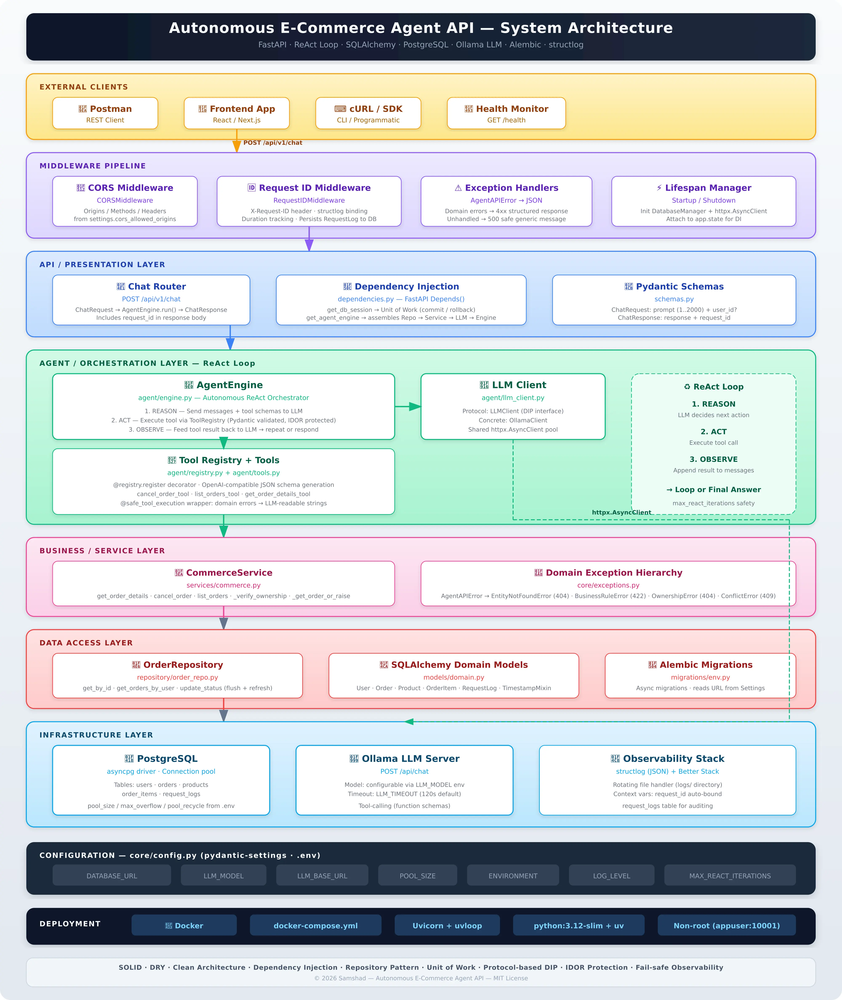

# Autonomous Agent API

Async FastAPI API that acts as an **autonomous customer support agent**: natural language → ReAct loop + tool use (order lookup, cancel, list) → PostgreSQL via SQLAlchemy → natural language response.

## System Architecture



## Features

- **Natural language to action**: e.g. *"Cancel my order #12345"* → validated DB update
- **ReAct orchestration**: Reason → Act (tools) → Observe → repeat
- **Strict schema validation**: Pydantic + JSON Schema for LLM tool binding
- **100% async**: FastAPI, SQLAlchemy async ORM, `asyncpg`, `httpx` for LLM
- **DDD layout**: `api/` → `agent/` → `services/` → `repository/`
- **Neon Serverless Postgres**: SSL and pool settings tuned for Neon (scale-to-zero safe)
- **Request tracing**: Every request gets a `X-Request-ID` correlation header, persisted to `request_logs` table in Postgres
- **Alembic migrations**: Schema changes are version-controlled and applied via `alembic upgrade head`

## Database: Neon Serverless Postgres

The app is configured for **Neon** serverless Postgres:

1. Create a project at [Neon Console](https://console.neon.tech) and copy the connection string.
2. In the Connect dialog, use the connection string and change the scheme to `postgresql+asyncpg://`.
3. Ensure the URL includes `?ssl=require` (Neon requires SSL).
4. Optional: use the pooler endpoint for serverless/scale-to-zero.
5. Set `DATABASE_URL` in `.env`. Optionally set `POOL_RECYCLE_SECONDS` (e.g. `300`) to avoid stale connections after suspend.

## Quick start with Docker

```bash
# Build and run API
docker compose up -d

# Apply migrations (run once, or after pulling new migrations)
uv run alembic upgrade head

# Seed DB with demo data (run once)
uv run python seed_db.py
```

Then call the API:

```bash
curl -X POST http://localhost:8000/api/v1/chat \
  -H "Content-Type: application/json" \
  -d '{"prompt": "What is the status of order 1?", "user_id": 1}'
```

Health check:

```bash
curl http://localhost:8000/health
```

## Local development

- **Python 3.12+**, **uv**
- Create `.env` from `.env.example`, set `DATABASE_URL` and optionally `LLM_BASE_URL`.

```bash
uv sync
uv run alembic upgrade head
uv run python seed_db.py
uv run uvicorn agent_api.main:app --reload --port 8000
```

## Database migrations (Alembic)

```bash
# Apply all pending migrations
uv run alembic upgrade head

# Create a new migration after changing models in domain.py
uv run alembic revision --autogenerate -m "describe your change"

# Rollback one migration
uv run alembic downgrade -1

# View current migration state
uv run alembic current
```

## Project layout

```
src/agent_api/
├── main.py           # FastAPI app factory, lifespan, health check
├── api/              # Presentation: routes, dependencies
├── core/              # Config, DB, logging, exceptions, middleware
├── models/            # Domain ORM, HTTP schemas, agent payloads
├── repository/        # Data access (order_repo)
├── services/          # Business logic (commerce)
└── agent/             # ReAct engine, LLM client, tool registry, tools
migrations/            # Alembic migration scripts (version-controlled)
```

## Tests

```bash
# Unit + integration tests (no real DB required)
uv run pytest tests/unit/ tests/integration/test_database.py tests/integration/test_domain_models.py tests/integration/test_order_repo.py -v

# Full suite including real-DB tests (requires DATABASE_URL in .env)
uv run pytest -v

# With coverage
uv run pytest --cov=agent_api --cov-report=term-missing
```

---

## 🧪 Full Example Interaction (Copy-Paste for Postman)

> The following shows a realistic end-to-end session with the AI agent.
> After running `docker compose up -d` and `uv run python seed_db.py`, the database contains:
>
> | User ID | Name       | Order ID | Status     | Product            |
> |---------|------------|----------|------------|--------------------|
> | 1       | Test User  | 1        | pending    | Mechanical Keyboard|
> | 2       | Alice      | 2        | processing | Widget A           |
> | 3       | Bob        | 3        | shipped    | Widget B           |
>
> You can copy-paste every `curl` command below directly into your terminal or import them into Postman.

### 1️⃣ Health Check

```
GET http://localhost:8000/health
```

**Response:**
```json
{
  "status": "ok",
  "version": "0.1.0"
}
```

---

### 2️⃣ Ask the agent to list all orders for a user

```
POST http://localhost:8000/api/v1/chat
Content-Type: application/json

{
  "prompt": "Show me all my orders",
  "user_id": 1
}
```

**Response:**
```json
{
  "response": "Here are your orders:\n\n- **Order #1** | Status: pending | Date: 2026-03-01T04:02:00+00:00\n\nYou currently have 1 order on file. Would you like to do anything with it?",
  "request_id": "a1b2c3d4-e5f6-7890-abcd-ef1234567890"
}
```

**What happened behind the scenes:**
1. The LLM read the user's prompt: *"Show me all my orders"*
2. It decided to call the `list_orders_tool` with `user_id=1`
3. The tool queried Postgres → found 1 order
4. The LLM read the tool's output and composed a natural-language summary

---

### 3️⃣ Ask the agent for details about a specific order

```
POST http://localhost:8000/api/v1/chat
Content-Type: application/json

{
  "prompt": "What is the status of order 1?",
  "user_id": 1
}
```

**Response:**
```json
{
  "response": "Order #1 is currently **pending**. It was placed on 2026-03-01. Would you like to cancel it or do anything else?",
  "request_id": "b2c3d4e5-f6a7-8901-bcde-f12345678901"
}
```

---

### 4️⃣ Cancel an order (success — order is pending)

```
POST http://localhost:8000/api/v1/chat
Content-Type: application/json

{
  "prompt": "Yes, please cancel order 1",
  "user_id": 1
}
```

**Response:**
```json
{
  "response": "Done! Order #1 has been successfully cancelled. The status is now 'cancelled'. Is there anything else I can help you with?",
  "request_id": "c3d4e5f6-a7b8-9012-cdef-123456789012"
}
```

**What happened:**
1. LLM called `cancel_order_tool` with `order_id=1, user_id=1`
2. `CommerceService` verified ownership (user 1 owns order 1) ✓
3. Business rule check: order was "pending" → cancellable ✓
4. Status updated to "cancelled" in Postgres via `OrderRepository`
5. LLM received the success confirmation and composed the reply

---

### 5️⃣ Try to cancel again (idempotent — already cancelled)

```
POST http://localhost:8000/api/v1/chat
Content-Type: application/json

{
  "prompt": "Cancel order 1",
  "user_id": 1
}
```

**Response:**
```json
{
  "response": "I wasn't able to cancel Order #1 because it's already been cancelled. No further action is needed. Is there anything else I can help with?",
  "request_id": "d4e5f6a7-b8c9-0123-defa-234567890123"
}
```

---

### 6️⃣ Try to cancel a shipped order (business rule rejection)

```
POST http://localhost:8000/api/v1/chat
Content-Type: application/json

{
  "prompt": "Cancel order 3",
  "user_id": 3
}
```

**Response:**
```json
{
  "response": "I'm sorry, but I can't cancel Order #3 because it has already been shipped. For shipped orders, please contact our support team to arrange a return.",
  "request_id": "e5f6a7b8-c9d0-1234-efab-345678901234"
}
```

---

### 7️⃣ Try to access another user's order (ownership guard)

```
POST http://localhost:8000/api/v1/chat
Content-Type: application/json

{
  "prompt": "What's the status of order 2?",
  "user_id": 1
}
```

**Response:**
```json
{
  "response": "I wasn't able to find Order #2 in your account. Please double-check the order number and try again.",
  "request_id": "f6a7b8c9-d0e1-2345-fabc-456789012345"
}
```

> ⚠️ **Security note:** The API deliberately returns "not found" instead of "access denied" to avoid leaking the existence of other users' orders.

---

### 8️⃣ Vague prompt — agent asks for clarification

```
POST http://localhost:8000/api/v1/chat
Content-Type: application/json

{
  "prompt": "I want to cancel my order",
  "user_id": 2
}
```

**Response:**
```json
{
  "response": "I'd be happy to help you cancel an order! Could you please provide me with the order number you'd like to cancel?",
  "request_id": "a7b8c9d0-e1f2-3456-abcd-567890123456"
}
```

> The LLM doesn't guess — it follows the system prompt instruction to ask for the order ID.

---

### 9️⃣ Verify the X-Request-ID response header

Every response includes the `X-Request-ID` header for distributed tracing:

```bash
curl -i -X POST http://localhost:8000/api/v1/chat \
  -H "Content-Type: application/json" \
  -d '{"prompt": "Show my orders", "user_id": 1}'
```

**Response headers:**
```
HTTP/1.1 200 OK
content-type: application/json
x-request-id: a1b2c3d4-e5f6-7890-abcd-ef1234567890
```

You can also **send your own** request ID for tracing across services:

```bash
curl -X POST http://localhost:8000/api/v1/chat \
  -H "Content-Type: application/json" \
  -H "X-Request-ID: my-custom-trace-id-123" \
  -d '{"prompt": "Show my orders", "user_id": 1}'
```

The API will use your provided ID instead of generating one, and it will appear in:
- The response `X-Request-ID` header
- The response JSON body (`request_id` field)
- Every structured log line for that request
- The `request_logs` table in PostgreSQL

---

### 🔍 Query the request_logs table (Observability)

Every API request is persisted to the `request_logs` table in PostgreSQL:

```sql
SELECT request_id, method, path, status_code, duration_ms, client_host, created_at
FROM request_logs
ORDER BY created_at DESC
LIMIT 5;
```

| request_id | method | path | status_code | duration_ms | client_host | created_at |
|------------|--------|------|-------------|-------------|-------------|------------|
| a1b2c3d4-... | POST | /api/v1/chat | 200 | 2847.31 | 172.17.0.1 | 2026-03-01 10:05:12+00 |
| b2c3d4e5-... | POST | /api/v1/chat | 200 | 1523.89 | 172.17.0.1 | 2026-03-01 10:04:58+00 |
| c3d4e5f6-... | GET  | /health      | 200 | 1.23    | 172.17.0.1 | 2026-03-01 10:04:30+00 |

---

## Environment

All configuration is driven by environment variables (via `.env`). See `.env.example` for the full list.

| Variable                 | Description                                              | Default            |
|--------------------------|----------------------------------------------------------|--------------------|
| `DATABASE_URL`           | **Required.** Async Postgres URL (`postgresql+asyncpg://...?sslmode=require`) | —                  |
| `ENVIRONMENT`            | Runtime environment (`development`, `staging`, `production`) | `development`      |
| `DEBUG`                  | Enable debug mode and verbose console logging            | `False`            |
| `LLM_BASE_URL`           | LLM API base URL                                        | `http://host.docker.internal:11434` |
| `LLM_MODEL`              | Target model name                                       | `qwen3:8b`         |
| `LLM_API_KEY`            | Optional API key for cloud LLM providers                | —                  |
| `LLM_TIMEOUT`            | HTTP timeout for LLM calls (seconds)                    | `120.0`            |
| `MAX_REACT_ITERATIONS`   | Max ReAct loop iterations before aborting               | `10`               |
| `POOL_SIZE`              | SQLAlchemy connection pool size                          | `5`                |
| `POOL_MAX_OVERFLOW`      | Max connections above pool size                          | `10`               |
| `POOL_RECYCLE_SECONDS`   | Recycle DB connections after N seconds                   | `300`              |
| `CORS_ALLOWED_ORIGINS`   | JSON array of allowed CORS origins                       | `["*"]`            |
| `LOG_LEVEL`              | Root logging level                                       | `INFO`             |
| `LOG_DIR`                | Directory for rotating log files                         | `logs`             |
| `MAX_PROMPT_LENGTH`      | Max character length for user prompts                    | `2000`             |
| `BETTERSTACK_SOURCE_TOKEN` | Optional Better Stack observability token              | —                  |

## License

This project is licensed under the [MIT License](LICENSE).
